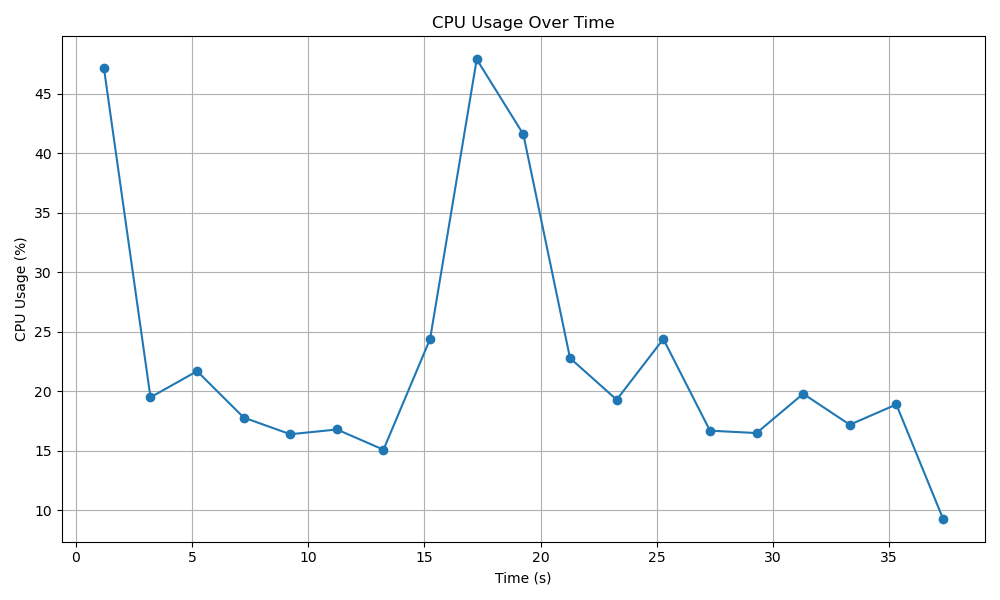
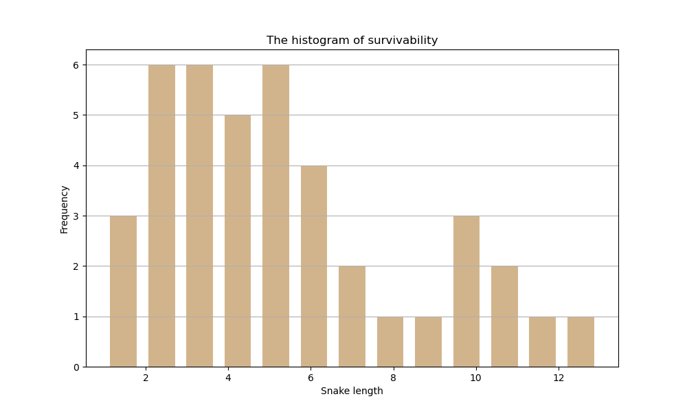
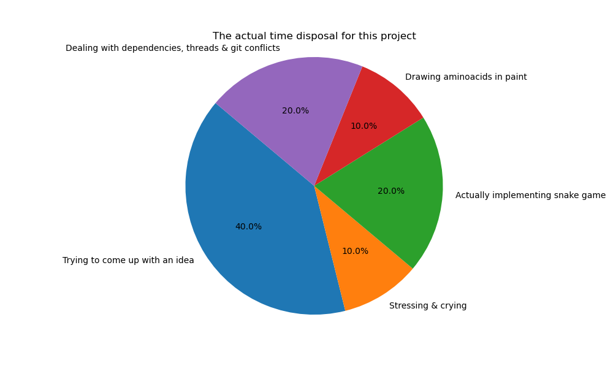

# prote.io :snake:

This is a version of snake game for biological freaks. Collect all the aminoacids to get the longest peptide possible!

## Installing the dependencies
This project has been created with `pypoetry` package and all dependencies are written in the `pyproject.toml` file. To install them, you need to have poetry installed first. Then you can get all necessary dependencies by executing one line of code.

```
pip install poetry
poetry install
```

> [!NOTE]
> This game requires Python version 3.12.

## Running the game
Once you've installed all necessary packages, it's time to play. To start the game, open the main prote.io directory and execute the script.

```
cd path/to/prote.io
./snake_game.sh
```

## Rules
They are as simple as possible. Move the snake with **W, A, S, D** keys and collect as many aminoacids as you can. The game engine is keeping track of them, so do not get distracted!<br>
And, last but not least - remember not to bite your own tail.

## Some statistics

### Monitoring CPU usage
This game has a built-in function used for monitoring CPU usage over the time. It is a decorator which tracks CPU usage every 1 second.<br>
Exemplary results for score 10 and estimated execution time of 30 seconds:


Similar plots are available in the `plots` directory (respectively for results 4 and 1)

### Histogram of survivability
The following results were obtained from a study conducted on voluntary testers.


### Bonus: actual time disposal
Does not need a comment...


## Have fun creating your own peptide! :shipit:
